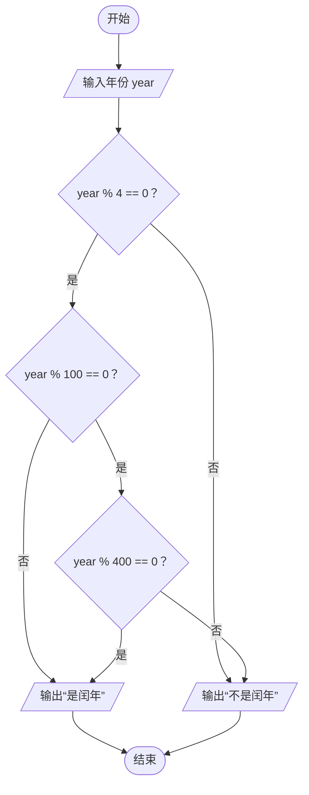
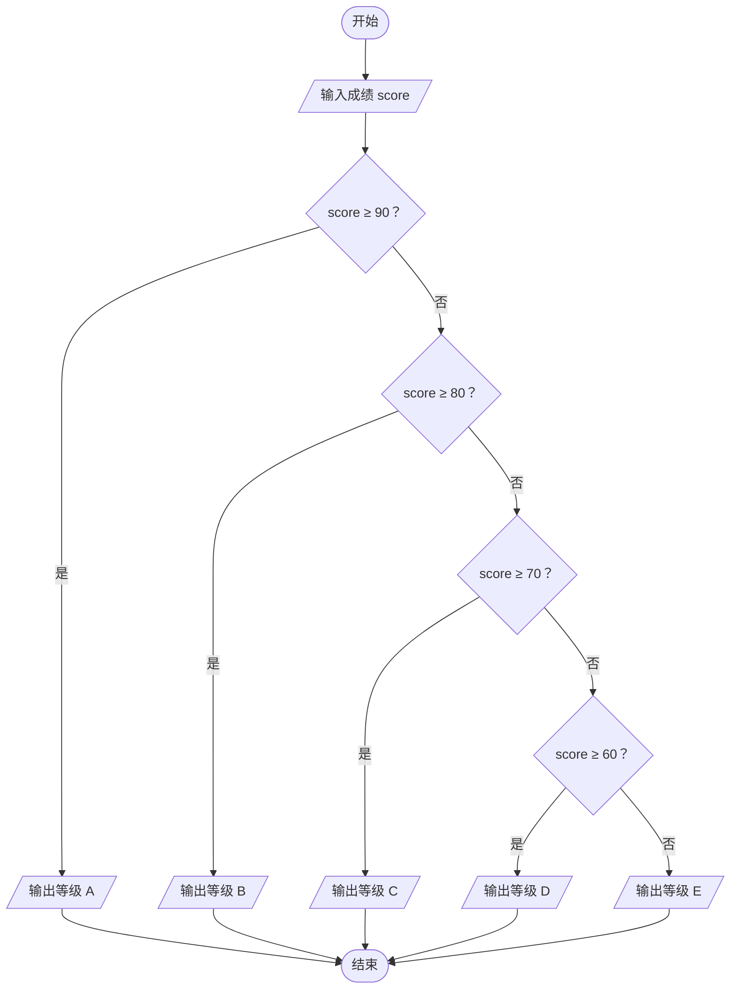

# Lab 4 书面作业参考答案

例 3.18 和例 3.19 的程序框图分别展示如何判断闰年和成绩等级。

<!-- more -->

## 例 3.18　判断闰年

`%` 表示取余，`year % 4 == 0` 表示年份能被 4 整除。

```mermaid
flowchart TD
    S([开始]) --> I[/"输入年份 year"/]
    I --> C{"year % 4 == 0？"}
    C -->|否| N[/"输出“不是闰年”"/]
    C -->|是| D{"year % 100 == 0？"}
    D -->|否| Y[/"输出“是闰年”"/]
    D -->|是| E{"year % 400 == 0？"}
    E -->|是| Y
    E -->|否| N
    Y --> F([结束])
    N --> F
```

## 例 3.19　判断成绩等级

```mermaid
flowchart TD
    S([开始]) --> I[/"输入成绩 score"/]
    I --> C1{"score ≥ 90？"}
    C1 -->|是| A[/"输出等级 A"/]
    C1 -->|否| C2{"score ≥ 80？"}
    C2 -->|是| B[/"输出等级 B"/]
    C2 -->|否| C3{"score ≥ 70？"}
    C3 -->|是| C[/"输出等级 C"/]
    C3 -->|否| C4{"score ≥ 60？"}
    C4 -->|是| D[/"输出等级 D"/]
    C4 -->|否| E[/"输出等级 E"/]
    A --> F([结束])
    B --> F
    C --> F
    D --> F
    E --> F
```
